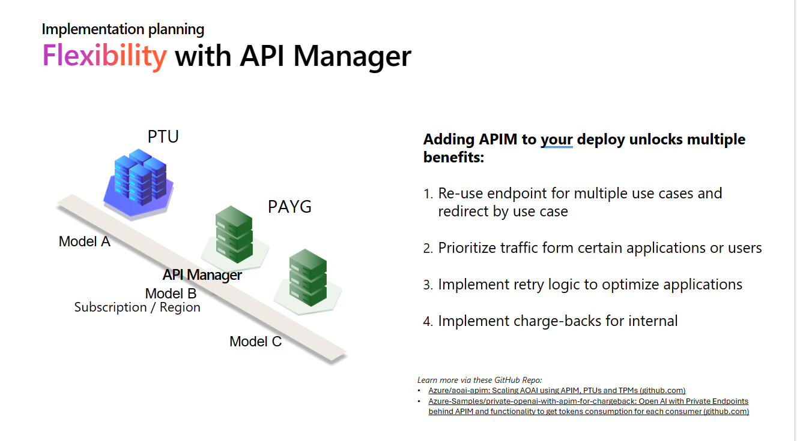
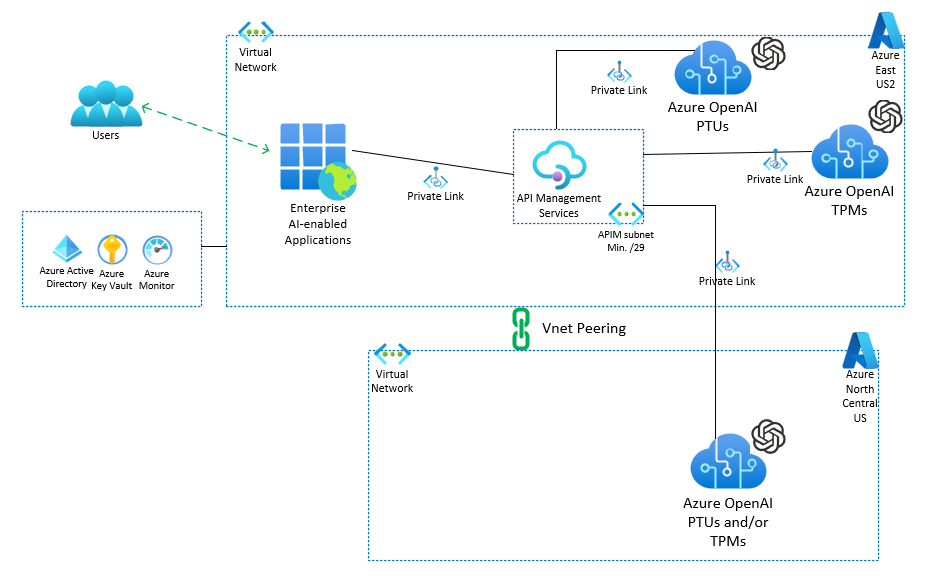
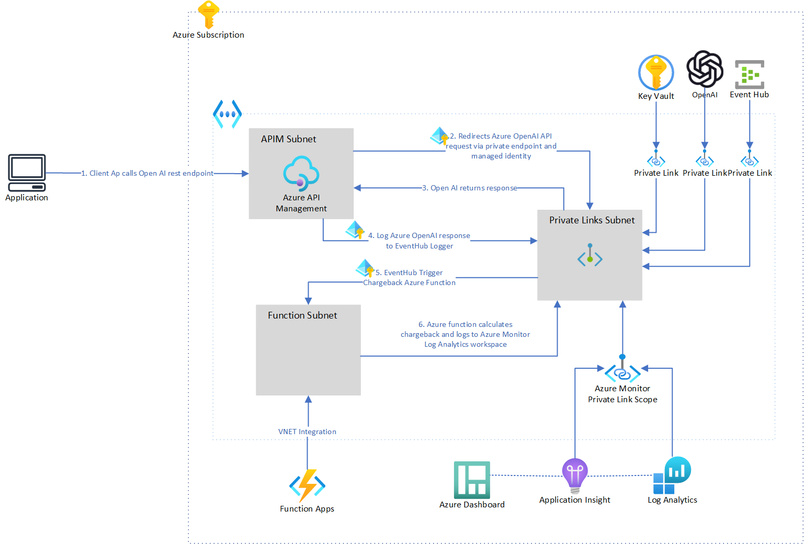

# APIM High Level

## Example justifications for APIM with Azure OpenAI

- Siloed business units purchasing AOAI model access via Paygo and running their own PTU justification analyses
- Business units individually assessing:  latency, variable throughput, scale limitations, and cost
- Scalability, reliable performance and predictable costs are important
- Several use cases are exceeding the intended capacity of Paygo.

## APIM Implementation Patterns

<https://github.com/Azure/aoai-apim>

<https://github.com/Azure-Samples/private-openai-with-apim-for-chargeback>

## APIM-AOAI Architectures

### Single Region

### Multi-Region

### Chargeback Architecture

