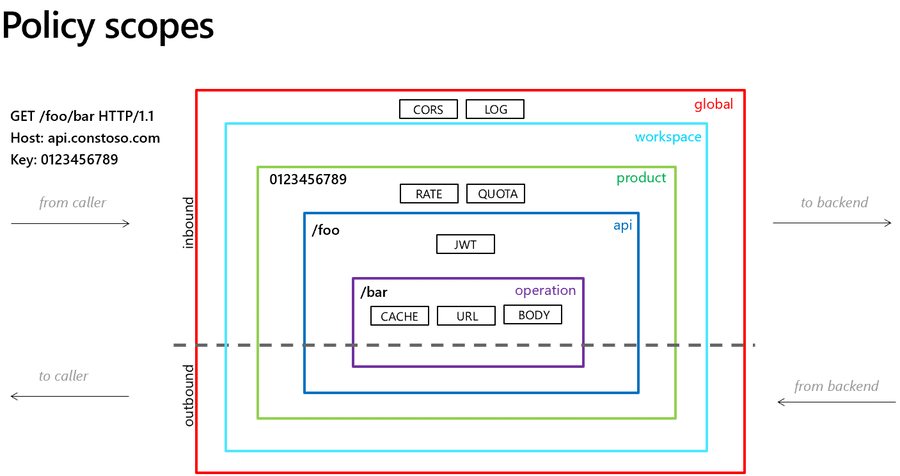

# Rate Limit By Key Policy

<https://learn.microsoft.com/en-us/azure/api-management/rate-limit-by-key-policy>

The `<rate-limit-by-key>` policy in Azure API Management (APIM) allows you to define rate limits that apply only to matching keys. This policy allows you to define expressions to identify the keys that are used to track traffic usage. You can use any arbitrary string value as a key, such as IP address, subscription ID, etc. The policy can be applied at different scopes: global, workspace, product, API, operation.

This policy is especially useful when you want to limit the rate of requests for different API operations or different users (identified by keys) differently.

The rate-limit-by-key policy prevents API usage spikes on a per key basis by limiting the call rate to a specified number per a specified time period.

The key can have an arbitrary string value and is typically provided using a policy expression. Optional increment condition can be added to specify which requests should be counted towards the limit. When this call rate is exceeded, the caller receives a 429 Too Many Requests response status code.

## Scopes

<https://learn.microsoft.com/en-us/azure/api-management/api-management-howto-policies#scopes>

API Management allows you to define policies at the following scopes, from most broad to most narrow:

- Global (all APIs)
- Workspace (all APIs associated with a selected workspace)
- Product (all APIs associated with a selected product)
- API (all operations in an API)
- Operation (single operation in an API)

When configuring a policy, you must first select the scope at which the policy applies.

